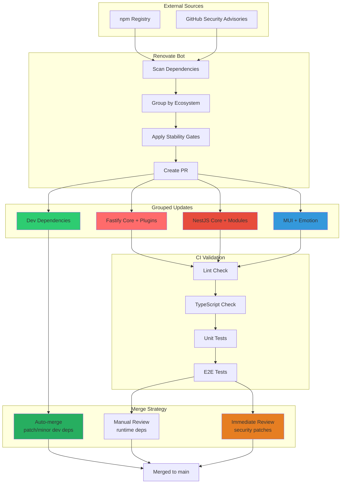
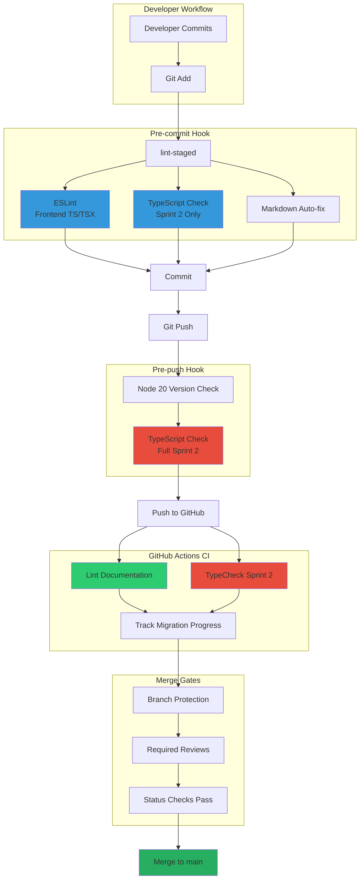
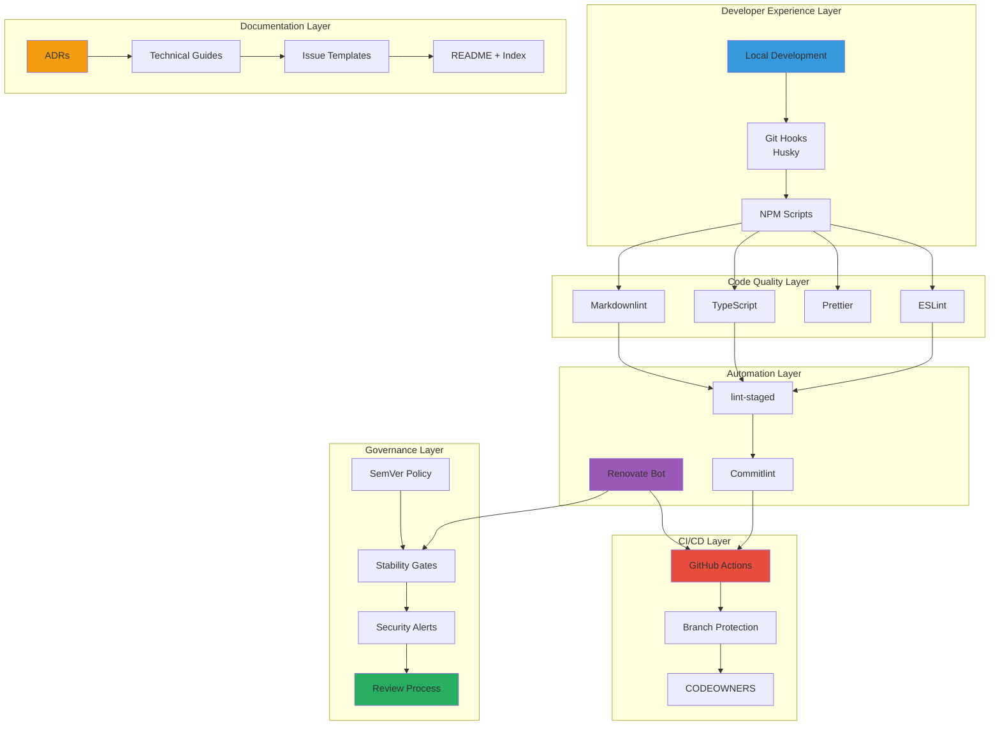
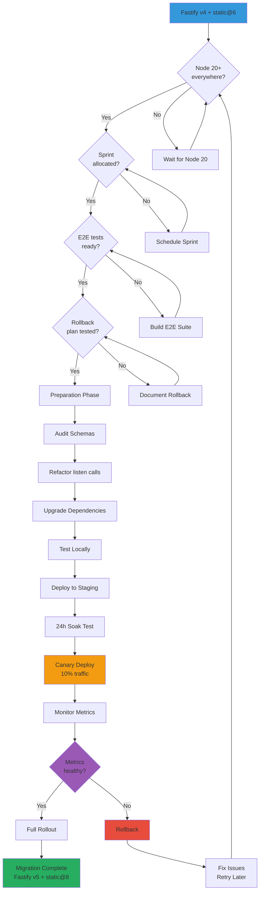
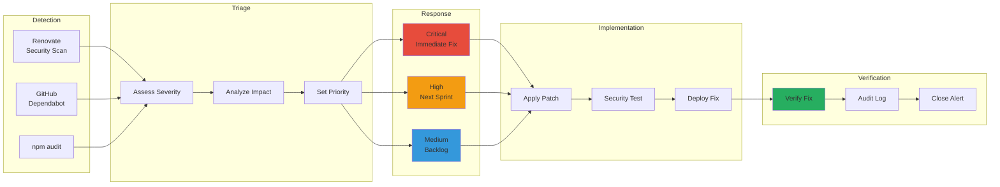
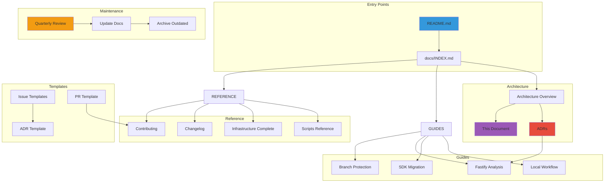
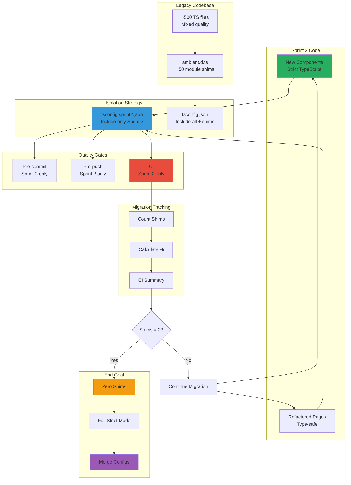
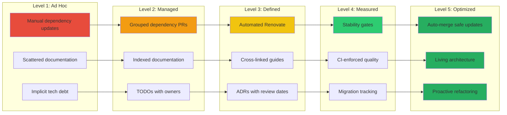

```mermaid
graph LR
    subgraph "Decision Trigger"
        ISSUE[Technical Issue<br/>or Opportunity]
        DEBATE[Team Discussion]
    end

    subgraph "ADR Creation"
        DRAFT[Draft ADR]
        CONTEXT[Document Context]
        ALTS[List Alternatives]
        DECISION[Make Decision]
    end

    subgraph "Documentation"
        FILE[Create ADR File<br/>docs/adr/NNNN-title.md]
        INDEX[Update ADR Index]
        XREF[Cross-link in<br/>Related Docs]
    end

    subgraph "Implementation"
        CODE[Implement Change]
        COMMIT[Commit with<br/>ADR Reference]
        ISSUE_TRACK[Create GitHub Issue<br/>if needed]
    end

    subgraph "Review & Maintenance"
        REVIEW[Quarterly Review]
        UPDATE[Update Status]
        SUPERSEDE[Supersede if<br/>Decision Changes]
    end

    ISSUE --> DEBATE
    DEBATE --> DRAFT
    DRAFT --> CONTEXT
    CONTEXT --> ALTS
    ALTS --> DECISION

    DECISION --> FILE
    FILE --> INDEX
    INDEX --> XREF

    XREF --> CODE
    CODE --> COMMIT
    COMMIT --> ISSUE_TRACK

    ISSUE_TRACK --> REVIEW
    REVIEW --> UPDATE
    UPDATE --> SUPERSEDE

    style DECISION fill:#e74c3c
    style FILE fill:#3498db
    style COMMIT fill:#2ecc71
    style REVIEW fill:#f39c12
```

# Architecture Diagrams

Visual representations of the Traffic CRM infrastructure, governance flows, and decision processes.

---

## 📦 Dependency Management Flow

---

## 🧭 Architecture Decision Record (ADR) Flow

---

## 🔄 CI/CD Pipeline with Quality Gates

---

## 🏗️ Infrastructure Layers

---

## 🔀 Fastify v5 Migration Decision Tree

---

## 🔐 Security & Compliance Flow

---

## 📊 Documentation Ecosystem

---

## 🎯 Sprint 2 TypeScript Migration Strategy

---

## 🔄 Continuous Improvement Cycle

```mermaid
graph LR
    subgraph "Measure"
        METRICS[Collect Metrics]
        FEEDBACK[Developer Feedback]
        INCIDENTS[Track Incidents]
    end

    subgraph "Analyze"
        PATTERNS[Identify Patterns]
        BOTTLENECKS[Find Bottlenecks]
        OPPORTUNITIES[Spot Opportunities]
    end

    subgraph "Plan"
        ADR_PLAN[Create ADR if needed]
        ISSUE_PLAN[Create GitHub Issue]
        PRIORITIZE[Prioritize Work]
    end

    subgraph "Implement"
        CODE_IMPL[Implement Change]
        TEST_IMPL[Test Thoroughly]
        DOCUMENT[Update Docs]
    end

    subgraph "Deploy"
        STAGE_DEPLOY[Deploy to Staging]
        PROD_DEPLOY[Deploy to Prod]
        MONITOR_DEPLOY[Monitor Impact]
    end

    subgraph "Review"
        RETRO[Retrospective]
        LESSONS[Document Lessons]
        ITERATE[Plan Next Iteration]
    end

    METRICS --> PATTERNS
    FEEDBACK --> PATTERNS
    INCIDENTS --> PATTERNS

    PATTERNS --> BOTTLENECKS
    BOTTLENECKS --> OPPORTUNITIES

    OPPORTUNITIES --> ADR_PLAN
    ADR_PLAN --> ISSUE_PLAN
    ISSUE_PLAN --> PRIORITIZE

    PRIORITIZE --> CODE_IMPL
    CODE_IMPL --> TEST_IMPL
    TEST_IMPL --> DOCUMENT

    DOCUMENT --> STAGE_DEPLOY
    STAGE_DEPLOY --> PROD_DEPLOY
    PROD_DEPLOY --> MONITOR_DEPLOY

    MONITOR_DEPLOY --> RETRO
    RETRO --> LESSONS
    LESSONS --> ITERATE

    ITERATE --> METRICS

    style PATTERNS fill:#3498db
    style ADR_PLAN fill:#e74c3c
    style DOCUMENT fill:#f39c12
    style MONITOR_DEPLOY fill:#9b59b6
    style ITERATE fill:#27ae60
```

---

## 📈 Maturity Model

**Current State**: Level 4 (Measured) → Level 5 (Optimized)

---

## 🎓 How to Use These Diagrams

### For Onboarding

- Start with **Infrastructure Layers** to understand the stack
- Review **CI/CD Pipeline** to see quality gates
- Study **Documentation Ecosystem** to navigate docs

### For Architecture Reviews

- Reference **Dependency Management Flow** for update strategy
- Use **ADR Flow** when making decisions
- Consult **Fastify v5 Migration Decision Tree** for planning

### For Troubleshooting

- Check **Security & Compliance Flow** for vulnerability response
- Review **Sprint 2 TypeScript Migration** for type errors
- Follow **Continuous Improvement Cycle** for systemic issues

### For Presentations

- **Maturity Model** shows progress over time
- **Infrastructure Layers** explains the system holistically
- **Dependency Management Flow** demonstrates automation

---

## 📚 Related Documentation

- [Infrastructure Hardening Complete](../INFRASTRUCTURE_HARDENING_COMPLETE.md)
- [Fastify Dependency Analysis](./FASTIFY_DEPENDENCY_ANALYSIS.md)
- [ADR Index](./adr/README.md)
- [Architecture Overview](./ARCHITECTURE_OVERVIEW.md)

---

**Last Updated**: October 24, 2025  
**Maintained By**: Engineering Team  
**Diagrams**: Mermaid (GitHub-native rendering)
